# halfgone

This repository contains implementations of *digital halftoning* - also called *dithering* -  algorithms written in Go. The implementations are restricted to black and white rendering and are based on the `image` library from Go's standard library.

The implementations are quite fast but are not optimized for production where you would typically want to use bit shifting when possible. I moved the common code for error-diffusion dithering into a separate functions because it's always the same underlying algorithm, whether it be Floyd-Steinberg dithering or Stucki dithering. I did the same for ordered dithering. In production you would probably want to choose a particular dithering algorithm and avoid using generic code which makes it harder to write optimized code.

If you are interested in digital halftoning, [this web page](http://www.efg2.com/Lab/Library/ImageProcessing/DHALF.TXT) is, in my opinion, a fantastic introduction. I've also written a [blog post](https://maxhalford.github.io/blog/halftoning-1/) which goes through some of the implementations.


## Original image

```go
img := LoadImage("images/penguin.jpg")
```


## Grayscale

```go
gray := ImageToGray(img)
```


## Inverted grayscale

```go
InvertGray(gray)
```

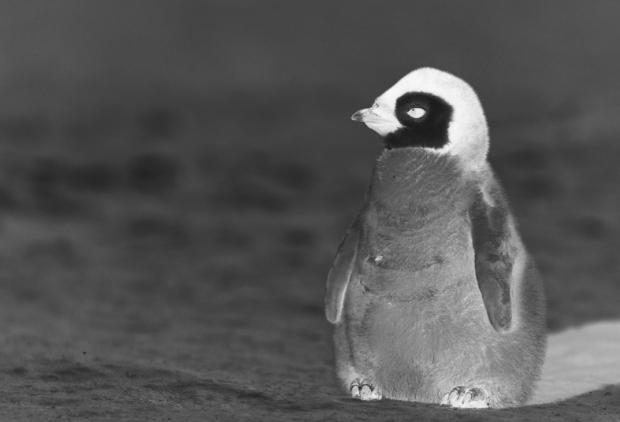


## Threshold dithering

```go
halfgone.ThresholdDitherer{Threshold: 127}.Apply(gray)
```

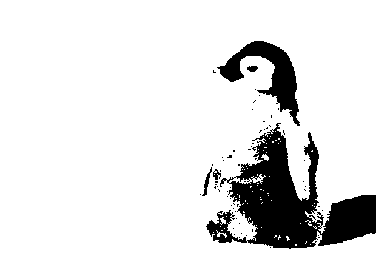


## Random threshold dithering

```go
halfgone.RandomThresholdDitherer{MaxThreshold: 255, RNG: rng}.Apply(gray)
```

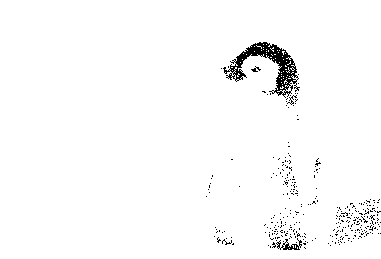


## Importance sampling

```go
halfgone.ImportanceSampling{N: 4000, Threshold: 100, RNG: rng}.Apply(gray)
```

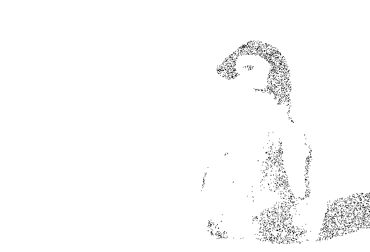


## Bosch and Herman’s grid-based dithering

```go
halfgone.GridDitherer{K: 5, Alpha: 3, Beta: 8, RNG: rng}.Apply(gray)
```

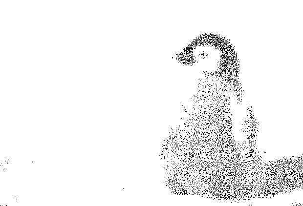


## Ordered dithering

### Order-2 ordered dithering

```go
halfgone.Order2OrderedDitherer{}.Apply(gray)
```

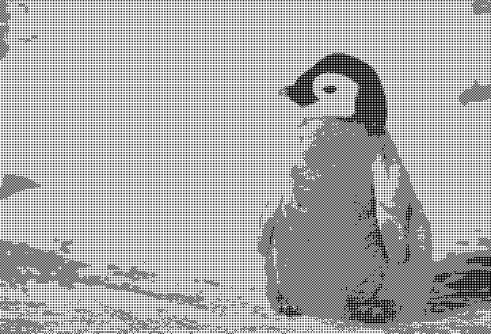


### Order-3 ordered dithering

```go
halfgone.Order3OrderedDitherer{}.Apply(gray)
```

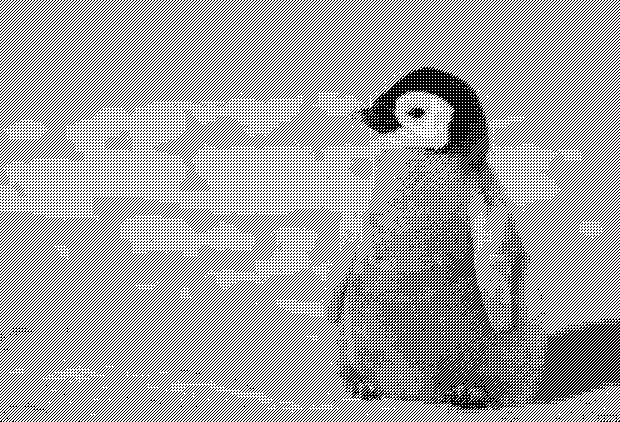


### Order-4 ordered dithering

```go
halfgone.Order4OrderedDitherer{}.Apply(gray)
```

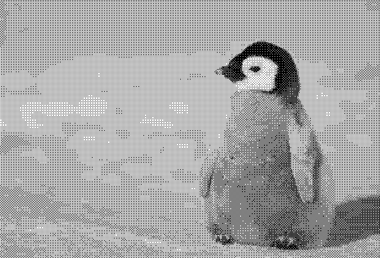


### Order-8 ordered dithering

```go
halfgone.Order8OrderedDitherer{}.Apply(gray)
```

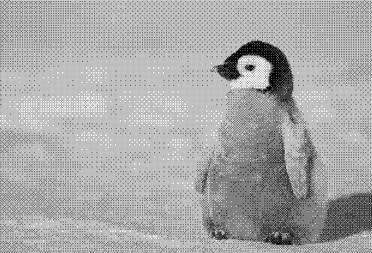


## Error-diffusion dithering

### Floyd-Steinberg dithering

```go
halfgone.FloydSteinbergDitherer{}.apply(gray)
```


### Jarvis-Judice-Ninke dithering

```go
halfgone.JarvisJudiceNinkeDitherer{}.Apply(gray)
```


### Stucki dithering

```go
halfgone.StuckiDitherer{}.Apply(gray)
```


### Atkinson dithering

```go
halfgone.AtkinsonDitherer{}.Apply(gray)
```

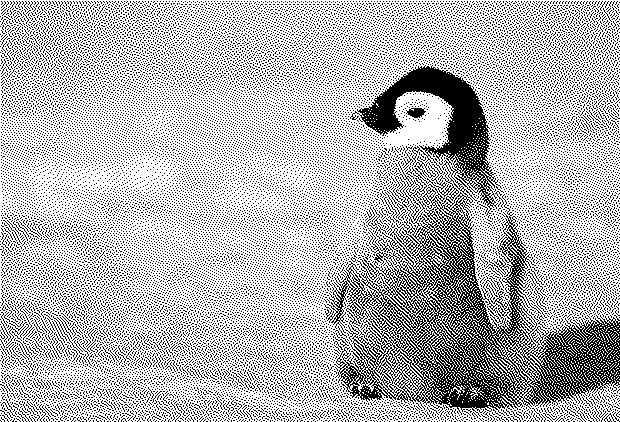


### Burkes dithering

```go
halfgone.BurkesDitherer{}.Apply(gray)
```

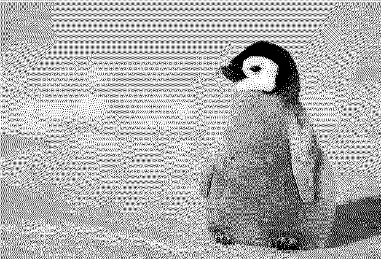


### Sierra dithering

```go
halfgone.SierraDitherer{}.Apply(gray)
```

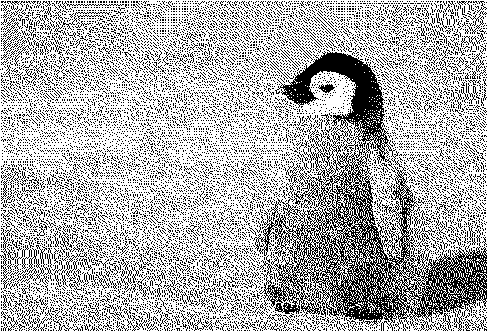


### Two-row Sierra dithering

```go
halfgone.TwoRowSierraDitherer{}.Apply(gray)
```


### Sierra Lite dithering

```go
halfgone.SierraLiteDitherer{}.Apply(gray)
```

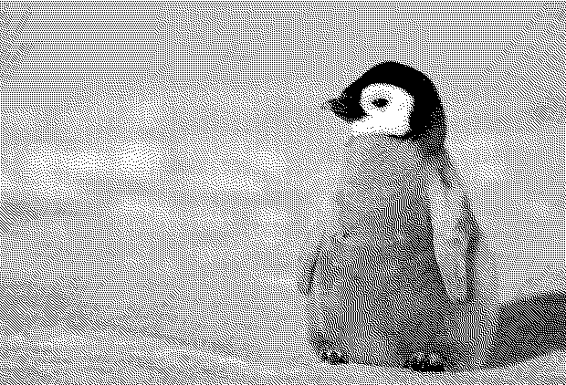

## License

The MIT License (MIT). Please see the [license file](LICENSE) for more information.
