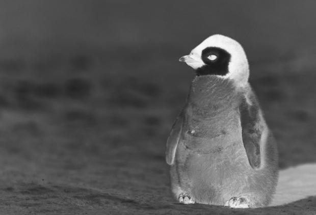
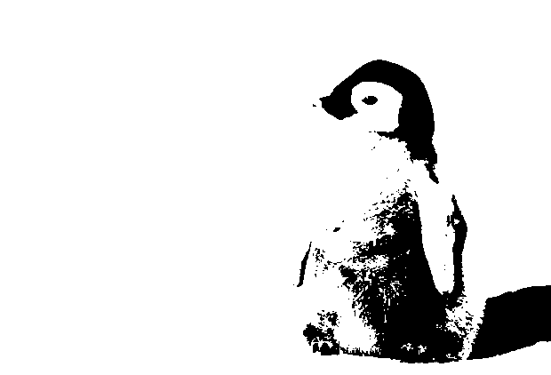
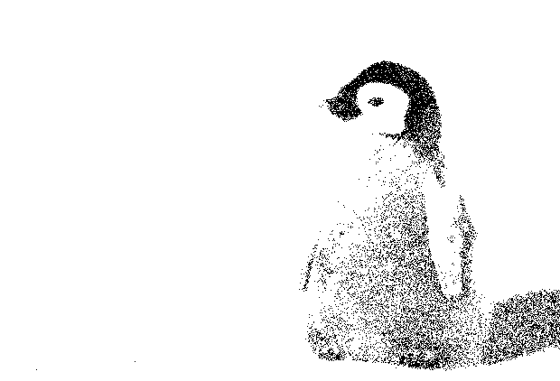
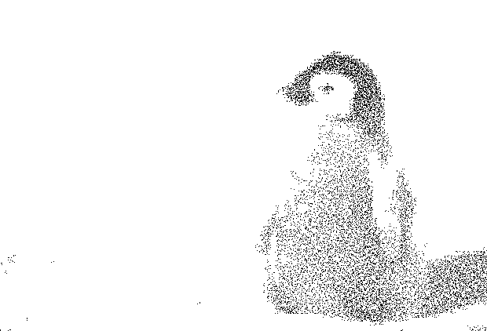

# halfgone

A collection of halftoning algorithms written in Go. For the while this is not aimed at being reused!

## Original image

```go
var img, err = LoadImage("screenshots/penguin.jpg")
```


## Grayscale

```go
var gray = rgbaToGray(img)
```


## Inverted grayscale

```go
var inverted = InvertGray(gray)
```



## Threshold dithering

```go
var td = ThresholdDitherer{
    thresold: 122,
}.apply(gray)
```



## Random threshold dithering

```go
var rtd = RandomThresholdDitherer{
    maxThreshold: 155,
    rng: rand.New(rand.NewSource(time.Now().UnixNano())),
}.apply(gray)
```



## Bosch and Herman’s grid-based dithering

```go
var gd = GridDitherer{
    k:     5, // Size in pixels of a side of a cell
    alpha: 3, // Minimum desired number of points in a cell
    beta:  8, // Maximum desired number of points in a cell
    rng:   rand.New(rand.NewSource(time.Now().UnixNano())),
}.apply(gray)
```



## Floyd-Steinberg dithering

```go
var fsd = FloydSteinbergDitherer{}.apply(gray)
```


