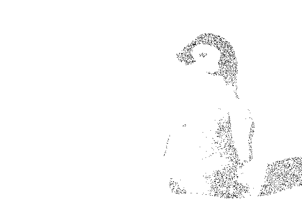

# halfgone

This repository contains implementations of *digital halftoning* - also called *dithering* -  algorithms written in Go. The implementations are restricted to black and white rendering and are based on the `image` library from Go's standard library.

The implementations are quite fast but are not optimized for production where one would typically want to use bit shifting when possible.

If you are interested in digital halftoning, [this web page](http://www.efg2.com/Lab/Library/ImageProcessing/DHALF.TXT) is, in my opinion, a fantastic introduction.


## Original image

```go
LoadImage("images/penguin.jpg")
```


## Grayscale

```go
ImageToGray(img)
```


## Inverted grayscale

```go
InvertGray(gray)
```


## Threshold dithering

```go
halfgone.ThresholdDitherer{Threshold: 122}.Apply(gray)
```


## Random threshold dithering

```go
halfgone.RandomThresholdDitherer{MaxThreshold: 100, RNG: rng}.Apply(gray)
```


## Importance sampling

```go
halfgone.ImportanceSampling{N: 4000, Threshold: 100, RNG: rng}.Apply(gray)
```




## Bosch and Herman’s grid-based dithering

```go
halfgone.GridDitherer{K: 5, Alpha: 3, Beta: 8, RNG: rng}.Apply(gray)
```


## Floyd-Steinberg dithering

```go
halfgone.FloydSteinbergDitherer{}.apply(gray)
```


## Jarvis-Judice-Ninke dithering

```go
halfgone.JarvisJudiceNinkeDitherer{}.Apply(gray)
```


## Stucki dithering

```go
halfgone.StuckiDitherer{}.Apply(gray)
```


## Atkinson dithering

```go
halfgone.AtkinsonDitherer{}.Apply(gray)
```


## Burkes dithering

```go
halfgone.BurkesDitherer{}.Apply(gray)
```


## Sierra dithering

```go
halfgone.SierraDitherer{}.Apply(gray)
```


## Two-row Sierra dithering

```go
halfgone.TwoRowSierraDitherer{}.Apply(gray)
```


## Sierra Lite dithering

```go
halfgone.SierraLiteDitherer{}.Apply(gray)
```


