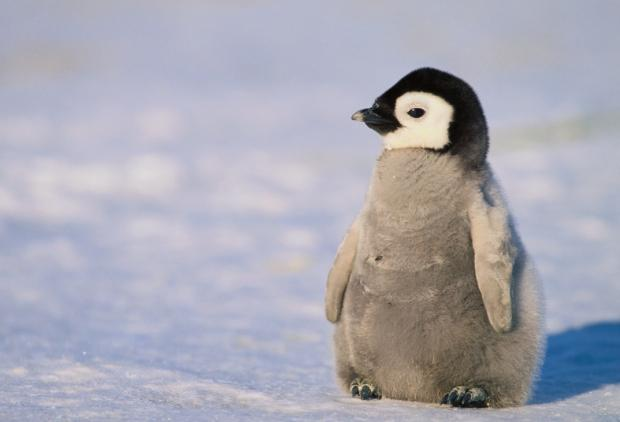

# halfgone

A collection of halftoning algorithms written in Go. For the while this is not aimed at being reused!


## Original image

```go
var img, err = LoadImage("images/penguin.jpg")
```




## Grayscale

```go
var gray = rgbaToGray(img)
```


## Inverted grayscale

```go
var inverted = InvertGray(gray)
```


## Threshold dithering

```go
var td = halfgone.ThresholdDitherer{Threshold: 122}.Apply(gray)
```


## Random threshold dithering

```go
var rtd = halfgone.RandomThresholdDitherer{MaxThreshold: 100, RNG: rng}.Apply(gray)
```


## Importance sampling

```go
var is = halfgone.ImportanceSampling{N: 2000, Threshold: 100, RNG: rng}.Apply(gray)
```


## Bosch and Herman’s grid-based dithering

```go
var gd = halfgone.GridDitherer{K: 5, Alpha: 3, Beta: 8, RNG: rng}.Apply(gray)
```


## Floyd-Steinberg dithering

```go
var fsd = halfgone.FloydSteinbergDitherer{}.apply(gray)
```


